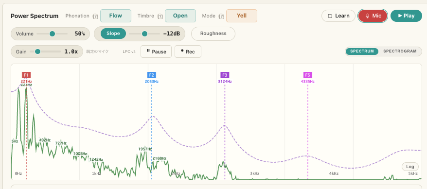
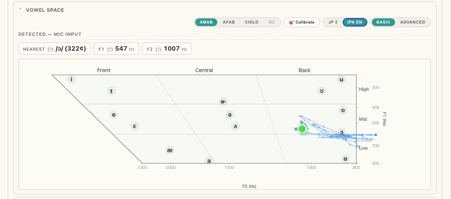

# PVA Source-Filter Simulation


声帯振動（**Source**）とフォルマント（**Filter**）をリアルタイムに操作し、パワースペクトラム・声門波形・母音空間を通じて発声の音響を学ぶ教育用 Web アプリです。マイク入力で自分の声を解析したり、録音して聴き返しながらフォルマントを観察できます。

🔗 **[source-filter-simulation.tori-shoichi.workers.dev](https://source-filter-simulation.tori-shoichi.workers.dev)**

参考書籍: *Practical Vocal Acoustics* — Kenneth Bozeman (NATS Books)


*マイク入力で、声のスペクトラム・フォルマント（F1–F5）・LPC エンベロープ（紫破線）をリアルタイム表示*

---

## 主な機能

### 🎛 Source（音源）
- Pitch (f₀) / Mechanism（M1 地声・M2 裏声）/ Pressure / Resistance
- **Rd**（LF モデルの声門波形形状）と発声モード（Flow / Pressed / Breathy）
- ビブラート合成（Rate / Extent / Onset Delay・Ramp / AM Depth / 波形）
- LF モデル（Liljencrants-Fant）による**声門流波形**の可視化

### 🔊 Filter（フィルタ）
- F1–F5 フォルマント（周波数 / Q / ゲイン / ON–OFF）
- 母音プリセット（[ɑ] [i] [u] [e] [o] ほか）

### 🎙 リアルタイム解析（マイク入力）
- パワースペクトラム + 倍音ラベル（Hz / Cent ずれ）
- フォルマント追跡 **LPC v3**（Burg 法 + Durand-Kerner 根探索 + One-Euro 平滑化）
- ピッチ検出（**YIN**）
- **Vowel Space**（F1×F2 母音空間マップ、声道長プロファイル別キャリブレーション）
- ビブラート解析（速さ / 深さ / 規則性 / 信頼度）
- **Loudness Ceiling**（声量の上限ガード、押し込み・大声の抑制練習）
- スペクトログラム


*Vowel Space：検出した F1×F2 を IPA 母音図にマッピング（軌跡＋現在位置）*

### ⏺ 録音・再生
- 最大 60 秒の録音、**IndexedDB に端末内保存**（サーバー送信なし）
- A–B 区間リピート、再生速度 0.1x〜2x（**音程保持**）
- 再生中もスペクトラム / フォルマント / Vowel Space を**オフライン解析**（速度非依存で録音時の正確な周波数）

### 📱 その他
- PC 版 / モバイル版（768px 以下＋タッチで自動切替）
- PWA（Service Worker でオフライン動作）

---

## 🔒 プライバシー

録音・音声データはすべて**ブラウザ内（IndexedDB）**に保存され、サーバーには一切送信されません。アクセス解析は Cloudflare Web Analytics（Cookie 非依存・匿名のページビュー統計）のみです。

---

## 🧩 技術スタック

- 素の **HTML / CSS / JavaScript**（ビルドステップなし）
- **Web Audio API**（音源合成・解析）
- **LF モデル**（Fant, Liljencrants & Lin 1985）による声門波形
- **LPC**（Burg 法）+ Durand-Kerner 根探索、**YIN** ピッチ検出、自前 radix-2 **FFT**（再生時の窓解析）
- **IndexedDB**（録音の永続化）
- **Cloudflare Workers (Static Assets)** / Pages でホスティング

---

## 🛠 開発

```bash
cd docs && python3 -m http.server 8081
# http://localhost:8081 を開く
```

ビルド不要。`docs/` 内のファイルを直接編集します。

| ファイル | 役割 |
|---|---|
| `docs/index.html` | PC 版 UI |
| `docs/mobile.html` | モバイル版 UI |
| `docs/main.js` | **PC・モバイル共有**の全ロジック（音源合成・解析・描画・録音再生） |
| `docs/style.css` / `docs/mobile.css` | 各版のスタイル |
| `docs/recordings-db.js` | IndexedDB 録音ストア |
| `docs/sw.js` | Service Worker（オフラインキャッシュ） |

> `main.js` は PC・モバイル両方から読み込まれるため、片方にしか無い DOM 要素は `null` チェック必須。

---

## 🚀 デプロイ

`main` ブランチへ push すると Cloudflare Workers (Static Assets) に自動デプロイされます。

---

## 📚 参考文献

- Bozeman, K. *Practical Vocal Acoustics*. NATS Books.
- Fant, G., Liljencrants, J., & Lin, Q. (1985). *A four-parameter model of glottal flow*. STL-QPSR, 26(4), 1–13.
- Fant, G. (1995). *The LF-model revisited*. STL-QPSR, 36(2–3), 119–156.
